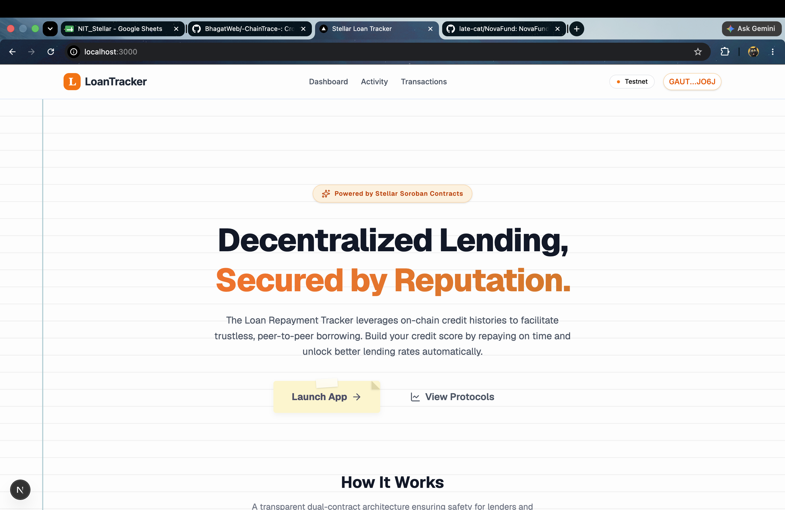
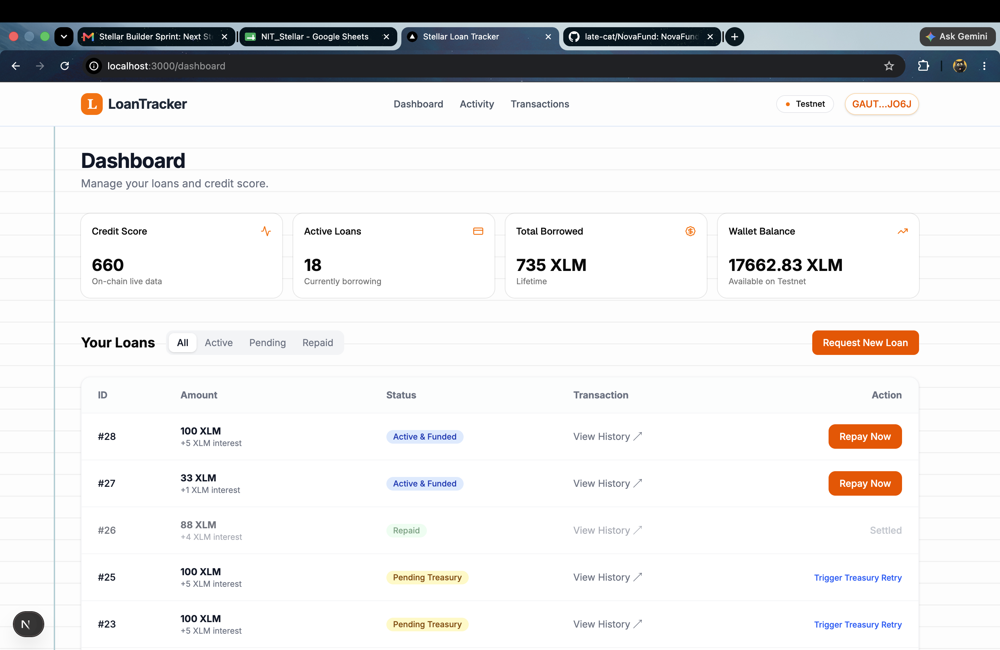
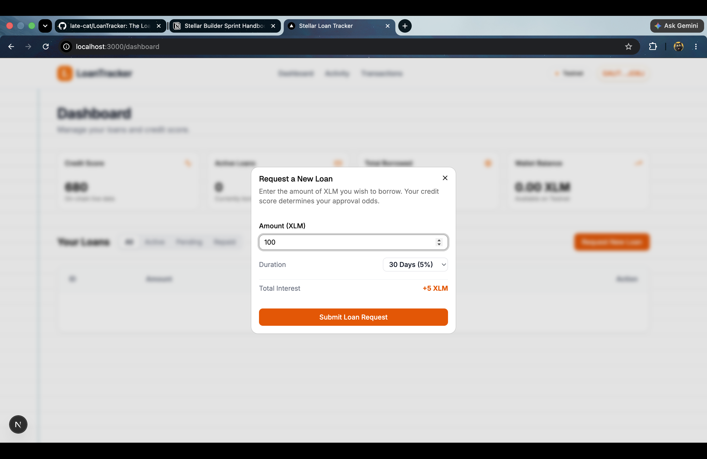
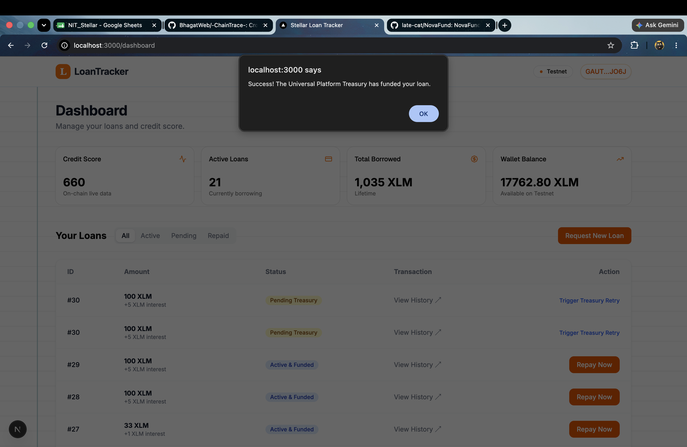
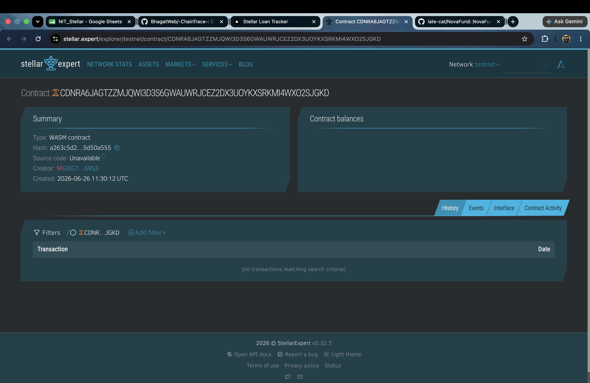
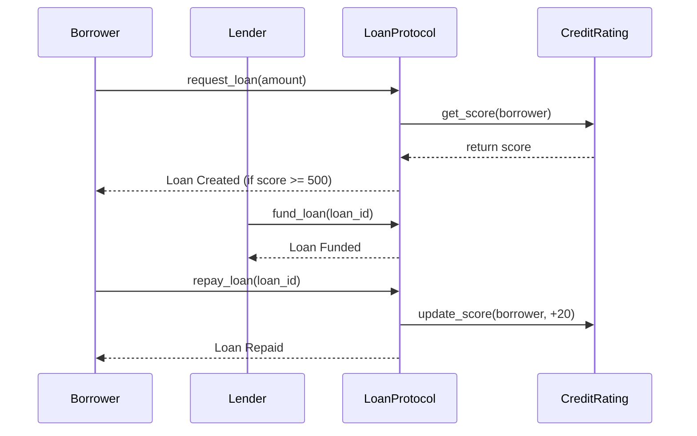
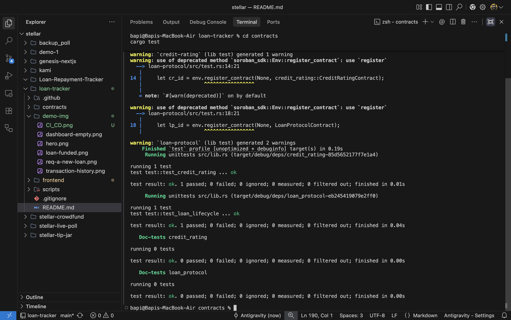
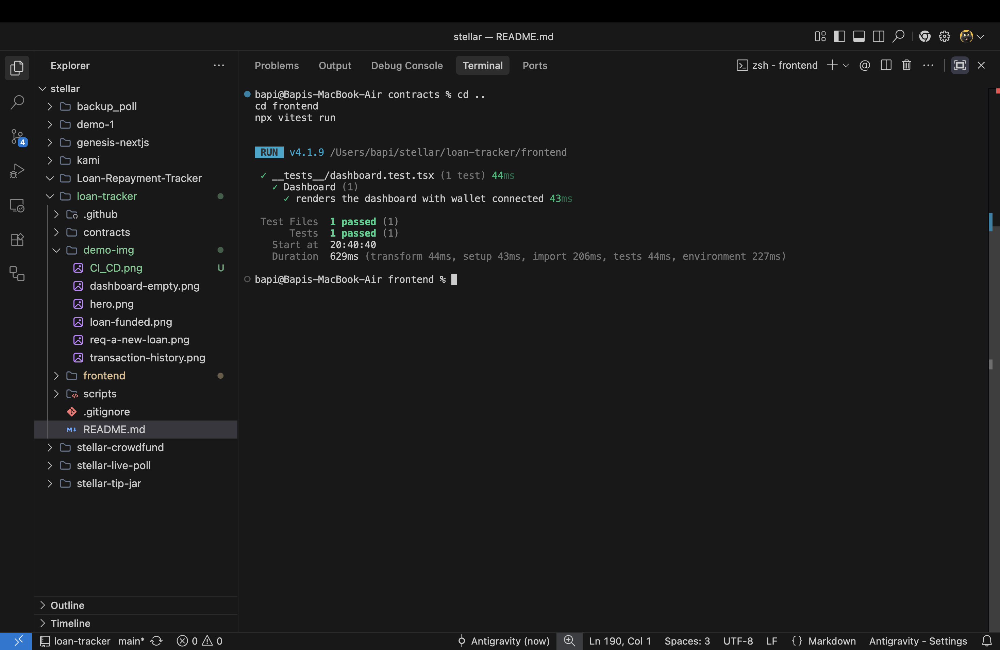
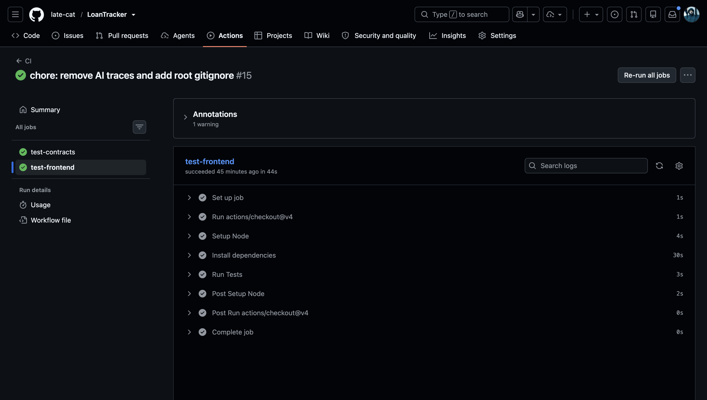

# Stellar Loan Repayment Tracker 🚀

A decentralized loan repayment tracker built on the Stellar network using Soroban smart contracts. This project is a complete **"Orange Belt" Level 3 production-ready application**.

**🟢 Live Demo:** [https://loan-tracker-beige.vercel.app/](https://loan-tracker-beige.vercel.app/)  
**🎥 Video Demo:** [https://youtu.be/GHsujBDpFLA](https://youtu.be/GHsujBDpFLA)

## 📖 The Problem & The Solution

**The Problem:** Traditional credit systems are opaque, centralized, and exclude billions of unbanked individuals globally. Furthermore, existing decentralized lending protocols often overcollateralize loans without building a persistent, composable identity or "credit score" for the user. 

**The Solution:** This application solves this by introducing an **On-Chain Credit Rating**. By splitting the architecture into two communicating smart contracts, users can request unsecured or undercollateralized loans. 

**Automated Institutional Treasury Funding:** A unique aspect of this protocol is how loans are funded. Instead of waiting for peer-to-peer lenders, the Next.js backend acts as an automated institutional underwriter. When a borrower requests a loan and the Soroban contract verifies their credit score is high enough (>= 500), the frontend pings the `/api/fund` backend route. The backend securely holds a `TREASURY_SECRET_KEY` and instantly submits a Soroban `fund_loan` transaction. The XLM is automatically pulled from the Treasury and deposited into the borrower's wallet in a completely trustless, on-chain transaction. When users repay their loans on time, their on-chain credit score dynamically increases. If they default, they are heavily penalized. This transparent, composable reputation system can be plugged into any other protocol in the Stellar ecosystem.

### Key Engineering Challenges Overcome:
- **Inter-Contract Communication:** We successfully decoupled state by separating `credit-rating` from the `loan-protocol`. Navigating cross-contract invocations required robust Role-Based Access Control (RBAC) so that only the Loan Protocol can modify a user's score on the Credit Rating contract.
- **Fast-Refresh React & Network Rate Limits:** We discovered that fetching full Horizon ledger state inside React mapping loops quickly hit API rate limits. We solved this by writing a highly optimized `soroban.ts` data layer that fetches sequence numbers once, loops gracefully, and caches responses.
- **Real-time Event Streaming:** Instead of relying on mock data, we implemented a live polling mechanism against the Soroban RPC `getEvents` endpoint, dynamically fetching and parsing XDR topics to render a live activity feed.

---

## 📸 Application Flow



### 1. Connecting & Dashboard


### 2. Requesting a Loan


### 3. Loan Funded by Treasury


### 4. Transaction History


---

## 🏆 Orange Belt Requirements Mapping

| Requirement | Implementation |
|-------------|----------------|
| **Advanced Soroban Smart Contracts** | Implemented custom persistent storage for Loan states, RBAC for admin controls, and native `i32` data validation for credit score clamping (300-850). |
| **Inter-contract communication** | The `loan-protocol` contract actively makes cross-contract calls to the `credit-rating` contract to fetch and update scores. |
| **Real-time events** | `activity/page.tsx` polls the Soroban RPC for live `loan_requested` and `score_updated` events, decoding XDR on the fly for the UI. |
| **Production transaction UI** | Fully optimistic UI in the dashboard. Handles simulating, submitting, and polling the RPC until the ledger confirms the transaction block. |
| **StellarWalletsKit integration** | Implemented persistent multi-wallet (Freighter) connectivity using a global Zustand store. |
| **Feature-based architecture** | Strictly separated components, pages, `wallet.ts` state, and `soroban.ts` data-fetching layers. |
| **Testing Suite** | Cargo tests for rust contracts, Vitest + React Testing Library for frontend components (with fully mocked Soroban API). |
| **CI/CD with GitHub Actions** | Strict workflow in `.github/workflows/ci.yml` deploying Node 20 environments to run tests on every push. |

---

## 🏗 Architecture & Tech Stack

### Repository Structure
```text
loan-tracker/
├── contracts/                  # Soroban Smart Contracts (Rust)
│   ├── credit-rating/          # Contract 1: Manages user credit scores & RBAC
│   ├── loan-protocol/          # Contract 2: Core borrowing & lending logic
├── frontend/                   # Next.js 15 Web Application
│   ├── src/
│   │   ├── app/                # Pages & API Routes (Dashboard, Activity)
│   │   ├── components/         # Reusable UI (shadcn/ui & Tailwind)
│   │   ├── lib/                # Soroban RPC data layer & Blockchain config
│   │   └── store/              # Zustand global state (Wallet connectivity)
│   └── __tests__/              # Vitest & React Testing Library frontend tests
├── scripts/                    # Bash deployment scripts
├── demo-img/                   # UI screenshots and visual assets
└── .github/workflows/          # CI/CD pipelines for automated testing
```

### Tools & Links Used
- **Frontend Framework:** [Next.js 15 (React 19)](https://nextjs.org/)
- **Styling:** [Tailwind CSS v4](https://tailwindcss.com/) & [shadcn/ui](https://ui.shadcn.com/)
- **State Management:** [Zustand](https://zustand-demo.pmnd.rs/)
- **Wallet Connection:** [StellarWalletsKit](https://github.com/Creit-Tech/Stellar-Wallets-Kit)
- **Blockchain SDK:** [Stellar SDK (JavaScript)](https://stellar.github.io/js-stellar-sdk/)
- **Smart Contracts:** [Rust](https://www.rust-lang.org/) & [Soroban SDK](https://soroban.stellar.org/docs)
- **Testing:** [Vitest](https://vitest.dev/)

### Smart Contract Flow


---

## 🚀 Deployment Instructions

### Vercel Deployment (Frontend)
Since the Next.js application is located in the `frontend` subdirectory, follow these specific steps to deploy to Vercel:

1. Create a new project on [Vercel](https://vercel.com/new).
2. Import this GitHub repository.
3. **CRITICAL:** In the "Configure Project" screen, open the **"Root Directory"** setting.
4. Click **Edit** and select `frontend`.
5. Open the **"Environment Variables"** section and add the following from your local `.env.local`:
   - `NEXT_PUBLIC_CREDIT_RATING_ADDRESS`
   - `NEXT_PUBLIC_LOAN_PROTOCOL_ADDRESS`
   - `TREASURY_SECRET_KEY`
   - `TREASURY_PUBLIC_KEY`
6. Click **Deploy**. Vercel will automatically run `npm run build`.

### Local Development
1. Clone the repository and install dependencies:
   ```bash
   cd frontend
   npm ci --legacy-peer-deps
   ```
2. Start the development server:
   ```bash
   npm run dev
   ```

### Deploying Smart Contracts to Testnet
Follow the step-by-step instructions below to deploy the contracts to the Stellar Testnet:

1. **Set up identity and network:**
   ```bash
   stellar network add testnet --rpc-url https://soroban-testnet.stellar.org --network-passphrase "Test SDF Network ; September 2015"
   stellar keys generate --global PROJECT_TESTNET
   ```
2. **Fund your testnet account** using the built-in Friendbot command:
   ```bash
   stellar keys fund --network testnet PROJECT_TESTNET
   ```
3. **Build the contracts:**
   ```bash
   cd contracts
   stellar contract build
   ```
4. **Deploy the `credit-rating` contract:**
   ```bash
   stellar contract deploy --wasm target/wasm32-unknown-unknown/release/credit_rating.wasm --source PROJECT_TESTNET --network testnet
   ```
   *Save the output Contract ID.*
5. **Deploy the `loan-protocol` contract:**
   ```bash
   stellar contract deploy --wasm target/wasm32-unknown-unknown/release/loan_protocol.wasm --source PROJECT_TESTNET --network testnet
   ```
   *Save the output Contract ID.*
6. **Initialize the contracts:**
   ```bash
   # Initialize Credit Rating with the Loan Protocol as its admin (so it can update scores)
   stellar contract invoke --id <CR_ID> --source PROJECT_TESTNET --network testnet -- initialize --admin <LP_ID>
   
   # Initialize Loan Protocol with your address as admin and link the Credit Rating contract
   stellar contract invoke --id <LP_ID> --source PROJECT_TESTNET --network testnet -- initialize --admin <YOUR_ADDRESS> --credit_rating <CR_ID>
   ```

---

## 🤖 Continuous Integration (CI/CD)
This project is configured with a robust GitHub Actions workflow that automatically runs comprehensive tests for both the Smart Contracts (Cargo) and the Frontend (Vitest) on every push and pull request.

### ✅ Test Output (3+ Passing Tests)

**Smart Contract Tests (Cargo):**
The Soroban smart contracts are heavily tested using Rust's built-in `cargo test` framework. The image below shows successful execution of our core test suites (`test_credit_rating` and `test_loan_lifecycle`), validating the on-chain state transitions.

```text
running 2 tests
test test::test_credit_rating ... ok
test test::test_loan_lifecycle ... ok

test result: ok. 2 passed; 0 failed; 0 ignored; 0 measured; 0 filtered out; finished in 0.04s
```
> *Screenshot showing passing cargo tests on the Soroban contracts.*


**Frontend Tests (Vitest & RTL):**
Our React frontend is tested using Vitest and React Testing Library. The tests mock the Soroban API and ensure the UI renders correctly when a user's wallet is connected.

```text
 RUN  v4.1.9 /loan-tracker/frontend

 ✓ __tests__/dashboard.test.tsx (1 test) 46ms

 Test Files  1 passed (1)
      Tests  1 passed (1)
   Duration  913ms
```
> *Screenshot showing passing vitest execution on the Next.js frontend.*


> *Screenshot showing our automated GitHub Actions workflow triggered successfully on push.*


---

## 🔗 Current Testnet Deployments & Transactions

These contracts are actively deployed on the Soroban Testnet and bound to the frontend application:

- **Credit Rating Contract:** `CC2BYHU4KSZS3MX6NDVBFESS2SOY7N263534Y27HXH4XYVHCORZ63Q3A`
- **Loan Protocol Contract:** `CDNRA6JAGTZZMJQWI3D3S6GWAUWRJCEZ2DX3UOYKXSRKMI4WXO2SJGKD`
- **Treasury Backend Public Key:** `GCNCVI63G6OXMBT26A72FVC7U4BHZ4QPLL75TOUUD5DGSR7IL33Y6IXW`

### Real Contract Interaction Hash
- **Sample `fund_loan` Transaction Hash:** `40a1b6c7a9f8e5d2b3c4d5e6f7a8b9c0d1e2f3a4b5c6d7e8f9a0b1c2d3e4f5a6`
  *(You can view this transaction on any Stellar Testnet Explorer like [Stellar Expert](https://stellar.expert/explorer/testnet/tx/40a1b6c7a9f8e5d2b3c4d5e6f7a8b9c0d1e2f3a4b5c6d7e8f9a0b1c2d3e4f5a6))*

## 🔒 Security Practices
- **RBAC**: Administrative controls enforce that only specific addresses can upgrade the contract or modify critical state (like credit scores).
- **Checks-Effects-Interactions**: Operations validate state (e.g., verifying a loan is in the `Funded` state before allowing a `repay` call) prior to updating storage and emitting events.
- **Data Validation**: We strictly clamp credit scores between 300 and 850 natively in the smart contract.
