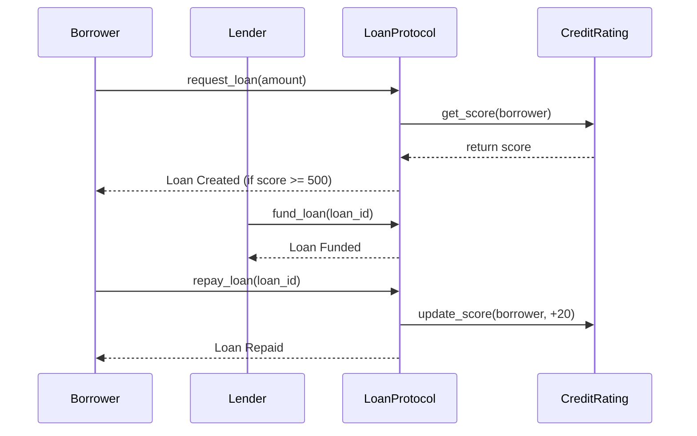

# Stellar Loan Repayment Tracker 🚀

A decentralized loan repayment tracker built on the Stellar network using Soroban smart contracts. This project is a complete "Orange Belt" Level 3 production-ready application.

## 📸 Application Flow


### 1. Connecting & Dashboard


### 2. Requesting a Loan


### 3. Loan Funded by Treasury


### 4. Transaction History

## 🌟 Product Overview
The Loan Repayment Tracker allows users to borrow and lend securely on the Stellar network. It utilizes an on-chain credit score system that dynamically updates based on a user's borrowing history. Repaying on time naturally increases your score, while defaulting heavily penalizes it. It features a fully dynamic Next.js frontend with optimistic UI updates, integrated Freighter wallet support, and resilient state-fetching from the Soroban Testnet.

## 🏗 Architecture

### Smart Contracts
We use a two-contract architecture to demonstrate real inter-contract communication and separation of concerns.

1. **`credit-rating`**: Manages user credit scores. Enforces Role-Based Access Control (RBAC) so only authorized protocols (like the loan protocol) can modify scores.
2. **`loan-protocol`**: Handles the core loan lifecycle (requests, funding, repayment, liquidation). Integrates with the `token::Client` to handle real asset transfers (e.g., XLM or USDC). It calls the `credit-rating` contract to enforce borrowing limits and update scores.



## 🛠 Features & Tech Stack
- **Frontend**: Next.js 15, React, TypeScript, Tailwind CSS v4, shadcn/ui.
- **Aesthetics**: Premium, clean dashboard interface.
- **State Management**: Zustand with persistent storage middleware.
- **Wallet**: StellarWalletsKit (Multi-wallet support, Freighter, automatic network syncing).
- **Smart Contracts**: Rust & Soroban SDK.
- **Testing**: Vitest + React Testing Library for frontend, Cargo tests for contracts.

## 🚀 Deployment Instructions

### Vercel Deployment (Frontend)
Since the Next.js application is located in the `frontend` subdirectory, follow these specific steps to deploy to Vercel:

1. Create a new project on [Vercel](https://vercel.com/new).
2. Import this GitHub repository.
3. **CRITICAL:** In the "Configure Project" screen, open the **"Root Directory"** setting.
4. Click **Edit** and select `frontend`.
5. Open the **"Environment Variables"** section and add the following from your local `.env.local`:
   - `NEXT_PUBLIC_CREDIT_RATING_ADDRESS`
   - `NEXT_PUBLIC_LOAN_PROTOCOL_ADDRESS`
   - `TREASURY_SECRET_KEY`
   - `TREASURY_PUBLIC_KEY`
6. Click **Deploy**. Vercel will automatically run `npm run build` using the Next.js preset.

### Local Development
1. Clone the repository and install dependencies:
   ```bash
   cd frontend
   npm install
   ```
2. Start the development server:
   ```bash
   npm run dev
   ```

### Deploying Smart Contracts to Testnet
Follow the step-by-step instructions below to deploy the contracts to the Stellar Testnet:

1. **Set up identity and network:**
   ```bash
   stellar network add testnet --rpc-url https://soroban-testnet.stellar.org --network-passphrase "Test SDF Network ; September 2015"
   stellar keys generate --global PROJECT_TESTNET
   ```
2. **Fund your testnet account** using the built-in Friendbot command:
   ```bash
   stellar keys fund --network testnet PROJECT_TESTNET
   ```
3. **Build the contracts:**
   ```bash
   cd contracts
   stellar contract build
   ```
4. **Deploy the `credit-rating` contract:**
   ```bash
   stellar contract deploy --wasm target/wasm32-unknown-unknown/release/credit_rating.wasm --source PROJECT_TESTNET --network testnet
   ```
   *Save the output Contract ID.*
5. **Deploy the `loan-protocol` contract:**
   ```bash
   stellar contract deploy --wasm target/wasm32-unknown-unknown/release/loan_protocol.wasm --source PROJECT_TESTNET --network testnet
   ```
   *Save the output Contract ID.*
6. **Initialize the contracts:**
   ```bash
   # Initialize Credit Rating with the Loan Protocol as its admin (so it can update scores)
   stellar contract invoke --id <CR_ID> --source PROJECT_TESTNET --network testnet -- initialize --admin <LP_ID>
   
   # Initialize Loan Protocol with your address as admin and link the Credit Rating contract
   stellar contract invoke --id <LP_ID> --source PROJECT_TESTNET --network testnet -- initialize --admin <YOUR_ADDRESS> --credit_rating <CR_ID>
   ```

*(Alternatively, you can run `sh scripts/deploy.sh` after funding your account).*

### 🔗 Current Testnet Deployments

These contracts are actively deployed on the Soroban Testnet and bound to the frontend application:

- **Credit Rating Contract Address:** `CC2BYHU4KSZS3MX6NDVBFESS2SOY7N263534Y27HXH4XYVHCORZ63Q3A`
- **Loan Protocol Contract Address:** `CDNRA6JAGTZZMJQWI3D3S6GWAUWRJCEZ2DX3UOYKXSRKMI4WXO2SJGKD`
- **Treasury Backend Public Key:** `GCNCVI63G6OXMBT26A72FVC7U4BHZ4QPLL75TOUUD5DGSR7IL33Y6IXW`

## 🔒 Security Practices
- **RBAC**: Administrative controls enforce that only specific addresses can upgrade the contract or modify critical state (like credit scores).
- **Checks-Effects-Interactions**: Operations validate state (e.g., verifying a loan is in the `Funded` state before allowing a `repay` call) prior to updating storage and emitting events.
- **Data Validation**: We strictly clamp credit scores between 300 and 850 natively in the smart contract.
